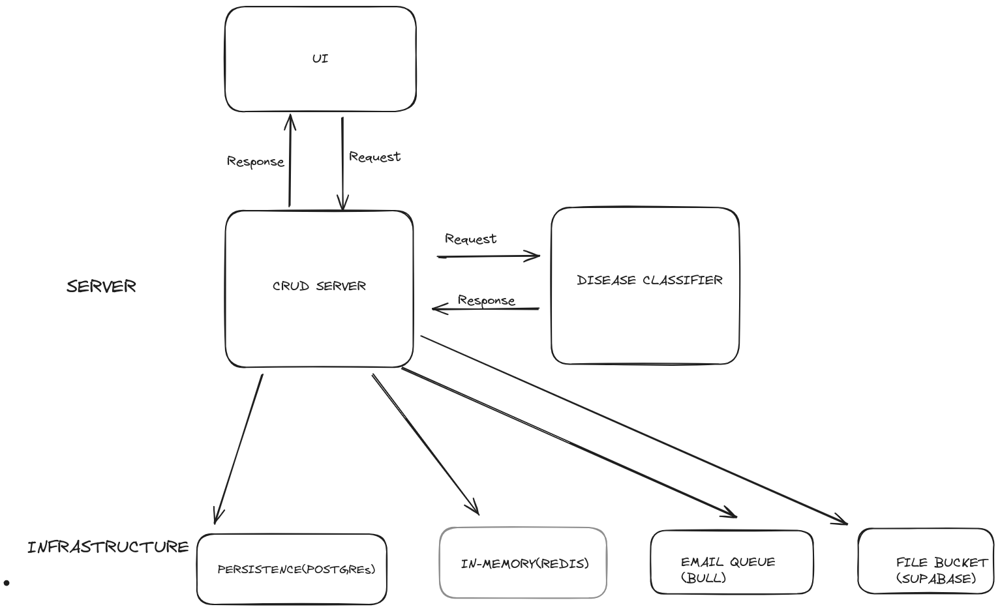

## Architectural notes  and Decisions for Disease classifier and Node Js Server

1.Diagram

2.Database
- Used postgres due to it level of ACID compliance and scalability and community support.Redis to store temporal or data that does not need to be persisted, and also incase we ever need caching for optimizations.

3.Authentication and authorization
- Cookie and tokens with jwt tokens are used to minimize the effort of the sever in trying to manage user session, this way the browser and the server share the responsibility.

4.File storage and uploads
- Used multer for file uploads from the client and supabase storage for 
as a bucket for storing the file, this way the database only stores the reference to the file as a url string, keeping the database "clean".

5.Testing
- Jest is used as the main testing library due to the robustness, and efficieny. It has a large support base too.
- Sinon is used for stubbing and mocking, because it is efficient
- Redis-mock is used for mocking redis interactions because redis works in a different way and has no clear directions on how to do this.
- The AAA pattern is used to keep the tests organised.
- Repositories are tested with a live database to ensure consistency another way would be to spy on the queries to ensure that the right sql statements are being made.
the services or use cases use stubbed versions of dependencies they rely on.

6.Data validation/Input validation
- Joi is used because it has a lot of features, mature and has a large community.

7.Job queues and workers
- Using job queues and workers to defer tasks from the main thread and bull is used due to it robustness.

8.Email Services
- Nodemailer is due to its maturity and support base.

9.Encryption standards
- RSA is used provides a safer way of encryption because keys are not shared between parties.

10.CI/CD
- Github actions is used it because the code recides in github and in this way we don't have to use another platform.

11.Monitoring
- Promclient because is the goto client library for prometheus and it has a large community.

12.Documentation
- Postman because it is feature rich and offers a platform where we can test our endpoints if the need arises.

13.Containerization
- Docker will allow devs to run code and infrasture together and most importantly to ensure consistency accross board and eliminate the "it only runs on my pc" problem.

## Machine Learning Aspect

- Please check the attatched article for more information. Please find the link below.

- https://drive.google.com/file/d/1Puwgc6n0p-yUk8krJFrzjU4lJHofm3iG/view?usp=sharing

